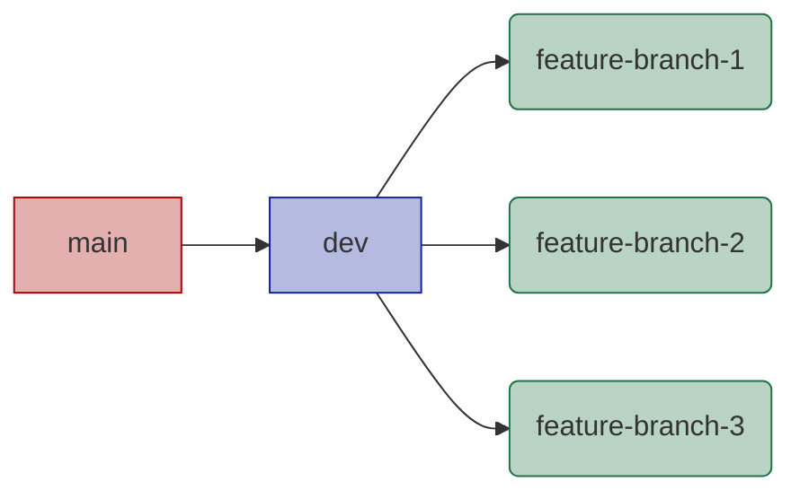
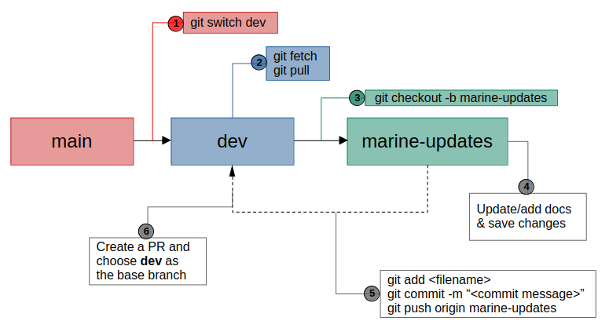
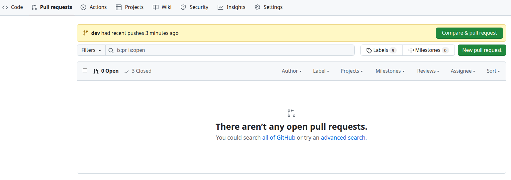
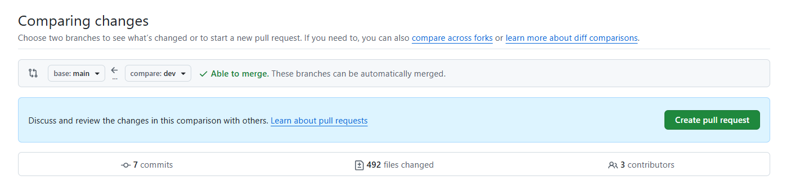

# NBA Website

## Important links

- Production website:

<https://sanbi-nba.github.io/nba-website>

- Testing website

<https://sanbi-nba.github.io/nba-website/site-preview>

## Get started

### 1. Create a GitHub account

If you don't have a GitHub account yet, go to <https://github.com\> and create an account.

### 2. Generate an SSH key

If you don't have an SSH key yet, run the following command in a terminal to generate an SSH key (replace `username` with your own username).

``` bash
ssh-keygen -t rsa -f ~/.ssh/id-rsa-sanbi -C username
```

You will be prompted to enter a passphrase. This passphrase adds an extra layer of security. You can leave it empty for no passphrase and just press `Enter`.

### 3. Add your `private` SSH key to the SSH agent:

Now also add your SSH **private** key to the SSH agent:

Use the following command:

``` bash
ssh-add ~/.ssh/id-rsa-sanbi
```

### 4. Add your `public` SSH key to GitHub:

Use the following command to see your the contents of your public key (in the relevant file name with the `.pub` extension) and then copy the entire key:

``` bash
cat ~/.ssh/id-rsa-sanbi.pub
```

Log into your GitHub account and add the SSH key to your account settings:

-   Click on your avatar.

-   Navigate to `Settings` \> `SSH and GPG keys`.

-   Click on `New SSH key`.

-   Add a custom title and then paste the key in the `Key` field.

-   Click on `Add SSH key`.

-   Next to your new key, click on the `Configure SSO` drop down, then choose the relevant repository name (e.g. `nba-website`).


### 5. **Configure the SSH locally**:

The first time that you add an SSH key pair locally, the `~/.ssh/config` file is populated automatically when you do the configuration. However, every time that you add another pair, you need to manually update the `~/.ssh/config` file.

For example, you can edit the file as follows:

```         
# Fathom GitHub
Host github.com-fathom
    HostName github.com
    IdentityFile ~/.ssh/id_rsa_fathom
    
# SANBI GitHub
Host github.com-sanbi
    HostName github.com
    IdentityFile ~/.ssh/id_rsa_sanbi
```

In the example above, there are two different pairs associated with two different GitHub accounts.

For each, the `Host` and `IdentityFile` is specified to match the specific accounts.

### 6. **Clone the repo**:

Whenever you need to clone a repo, you need to edit the git info of that repo to match with the correct SSH key info. Alternatively, if you've copied the repo to a new laptop, [7. Configure Git to use SSH] instead.

To do this, replace the information between the `@` and `:` with the `Host` info, as specified in the `config` file in the previous step.

For instance, using the info from the example above, if you want to clone the `SANBI-NBA/nba-website` repo, you can copy the link from the remote repo, and then edit it as follows:

``` bash
git clone git@github.com-sanbi:SANBI-NBA/nba-website.git
```

Note the `-sanbi` that was added to correspond to the host in the `config` file.

To confirm that the above is correct, `cd` into the repository that you cloned then run:

``` bash
git remote -v
```

### 7. Configure Git to use SSH

If you've copied the repo to a new laptop and you need to configure Git to use SSH, make sure to complete steps 2 to 5 before proceeding with the following steps.

First, see what URL your repository is currently using:

``` bash
git remote -v
```

If you see URLs starting with `https://github.com/`, you need to change your remote URL to use SSH instead:

``` bash
git remote set-url origin git@github.com-sanbi:SANBI-NBA/nba-website.git
```

Note the `-sanbi` that was added to correspond to the host in the `config` file.

### 8. Configure Git to use SANBI credentials:

In some cases, the username and/or email credentials for a specific repo can be different to your `global` git configuration. In this case, you can set up the `local` git configuration for that specific repo.

To view your `global` Git credentials, run:

``` bash
git config --global --list
```

To set up different credentials `locally` for a specific repo, `cd` into the relevant repo then run:
Note: Replace `username` with your GitHub username, and replace `name.surname@sanbi.org.za` with your email.

``` bash
git config --local user.name "username"
```

``` bash
git config --local user.email "name.surname@sanbi.org.za"
```

To view and confirm your `local` git configuration details for that repo, run:

``` bash
git config --local --list
```

### Resources:

-   [Using Multiple SSH keys - Beginner Friendly](https://gist.github.com/aprilmintacpineda/f101bf5fd34f1e6664497cf4b9b9345f)
-   [Multiple SSH Keys settings for different github accounts](https://gist.github.com/jexchan/2351996)
-   [Setting up multiple GitHub accounts, the nicer way](https://medium.com/uncaught-exception/setting-up-multiple-github-accounts-the-nicer-way-5ab732078a7e)

## Understand the repo

See [content/README.md](content/README.md).

## Git branches



The following branches are of interest:

1.  **main**

    Anything that is merged into this branch will be published on the production website (<https://sanbi-nba.github.io/nba-website\>). This branch is protected and only the `dev` branch can be merged into `main`.

2.  **dev**

    This branch is ahead of **main** (i.e., it contains new information that is not public yet) and gets published (i.e., merged into **main**) from time to time. A preview of these docs is available at <https://sanbi-nba.github.io/nba-website/site-preview\>.

3.  **feature-branch**

    Feature branches created by authors to update existing documentation or contribute new documentation. Feature branches are merged into **dev**.

## Contribute new PRs



### Create new PRs to add/modify content

| Step | Activity | Git command | Example |
|:--:|----|----|----|
| 1 | Switch to the **dev** branch | `git switch dev` | \- |
| 2 | Download all the latest changes from remote | `git fetch` | - |
|  | Update your local **dev** branch | `git pull` | \- |
| 3 | Create a new feature branch | `git checkout -b <feature-branch>` | `git checkout -b marine-updates` |
| 4 | Update/add docs and save changes | \- | \- |
| 5 | Add/stage changes | `git add filename` | `git add content/marine/marine_condition.qmd` |
|  | Commit changes | `git commit -m "<commit message>"` | `git commit -m "Update marine conditions"` |
|  | Push changes | `git push origin <feature-branch>` | `git push origin marine-updates` |
| 6 | Create a pull request (PR)\* | \- | \- |

\*Create a pull request (PR) on GitHub and choose **dev** as the **base** branch. If you're still busy with this PR, make sure to mark it as a draft. Mark the PR as `ready for review` once you are done. For detailed steps on how to create a PR, see the [official GitHub Docs](https://docs.github.com/en/pull-requests/collaborating-with-pull-requests/proposing-changes-to-your-work-with-pull-requests/creating-a-pull-request#creating-the-pull-request)

Lize von Staden or Andrew Skowno will review the PR and provide feedback or ask questions for clarification, and then merge into **dev**.

### Restore a file

If you want to discard your changes and restore the file to how it was before you made changes, you can run the following command:

`git restore <filename>` (e.g. `git restore file.R` or `git restore file.qmd`)

You can also use this same command to restore a deleted file.

If you want to restore a file from a specific commit:

`git restore --source=<commit-hash> <filename>` (e.g. `git restore --source=abc123 file.R`)

### Unstage a file

If you already staged your file (i.e. you already ran the `git add` command), but you decide that you want to keep your changes but not commit them yet, you can unstage the file by running the following command:

`git restore --staged <filename>`

### Revert a commit

Sometimes you might want to undo a bad change. In order to reverse the original commit, do the following:

1.  Switch to the feature branch of interest:

    `git switch my-feature-branch`

2.  Check the git logs:

    `git log --oneline` (copy the commit ID that you would like to revert)

3.  Revert the commit:

    `git revert <commit ID>`

4.  If there's a merge conflict, resolve it and do `git add <file>` and then `git revert --continue`

## Rebase PRs

If you created a feature branch off of the wrong base branch (e.g. you created your feature branch off of `main` instead of `dev`), you can rebase with the following commands:

1.  `git checkout my-feature-branch`

2.  `git rebase --onto dev main my-feature-branch`

3.  `git push --force-with-lease origin my-feature-branch`

## Publish preview to the live site

NB! Only Lize von Staden and Andrew Skowno can merge dev into main in order to publish content live.

1. Click `Pull requests`.
2. You can either click the green `Compare & pull request` button in the yellow banner, or just click the green `New pull request` button.



3. Choose `base: main` and `compare:dev` to compare changes, then click `Create pull request`.
   


4. Review the changes and then merge into `main` if everything looks good.