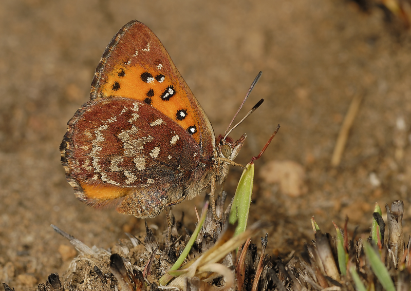

{fig-align="center"}

------------------------------------------------------------------------

::: {.callout-important icon="TRUE" title="Note:" style="--callout-icon-color: white; font-size:100px;"}
###### We are currently completing the status summary for butterflies. Please revisit this page soon for the full update!
:::
